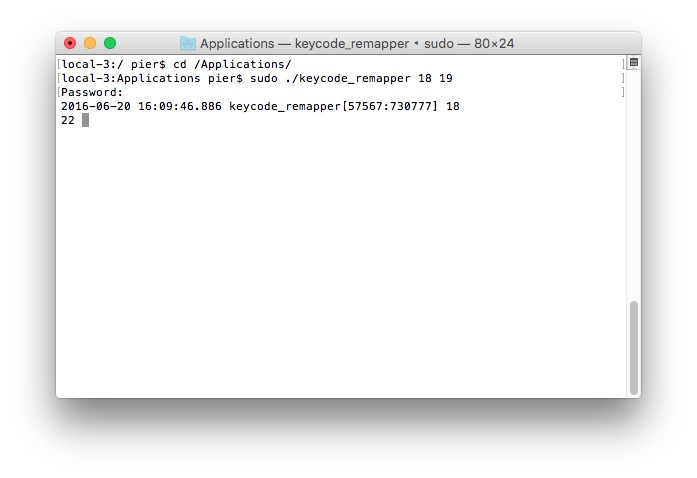
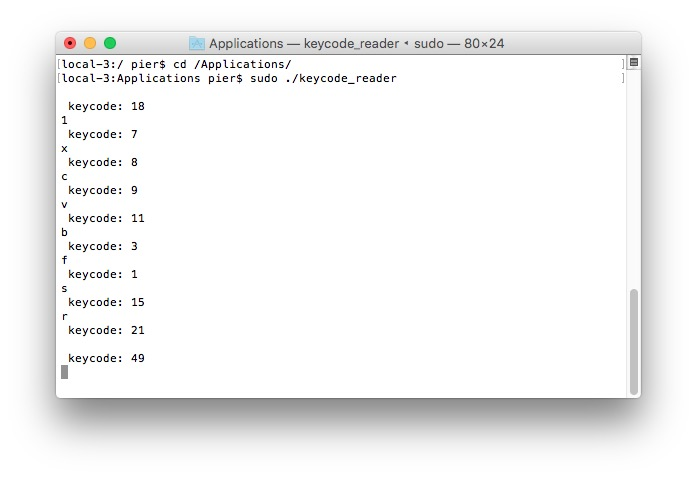

# day1 - What is a Switch?


We will use arcade designed boards to simulate keyboard events.
<p align="center" >
  
</p>
[ipac website](https://www.ultimarc.com/ipac1.html)


#keycode remapper
If you need keys that are not mapped in your keyboard you can use the utility **keycode_remapper**.


To install it just:
<p align="center" >
  
</p>
- copy keycode_remapper to your Applications folder;
- open the Terminal (Applications/Utility/Terminal);
- type: 


```
cd /Applications/
```

```
sudo ./keycode_remapper 18 19
```
- insert your password;


The utility in this case is remapping the keycode 18 ('1') to keycode 19 ('2').

To stop the process press crl+c or 

```
sudo killall "keycode_remapper"
```

#keycode reader

If you need to read the code of keystrokes just:

- copy keycode_reader to your Applications folder;
- open the Terminal (Applications/Utility/Terminal);
- type: 


```
cd /Applications/
```

```
sudo ./keycode_reader
```
- insert your password;

<p align="center" >
  
</p>

To stop the process press crl+c or 

```
sudo killall "keycode_reader"
```


